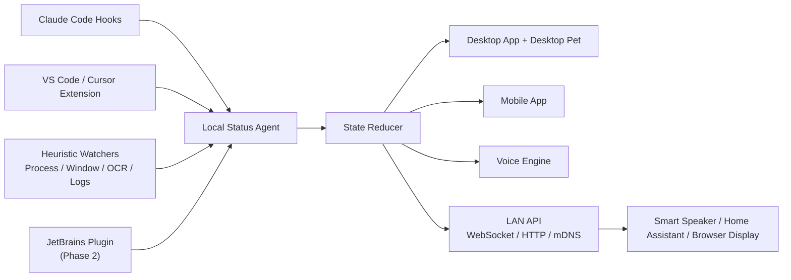

# CodeStatus Companion 产品设计 v0.1

## 1. 一句话定位

CodeStatus Companion 是一个跨 Coding 工具的状态监控、桌面宠物、语音播报和多端同步系统。它把 Claude Code、Cursor、VS Code 等开发工具的运行状态统一成标准事件，再在桌面、手机、局域网设备和语音通道里展示或播报。

## 2. 可行性结论

可行，但不能承诺所有软件都能达到同等深度。

原因是不同 Coding 软件开放能力不同：

- Claude Code 有 hooks 生命周期事件，适合做高精度状态采集。
- VS Code 有 Extension API，适合做官方扩展采集。
- Cursor 支持 VS Code 扩展管理，可优先复用 VS Code 扩展路线，但 Cursor 自身 AI Agent 的内部状态未必全部对第三方开放。
- 对没有开放 API 的软件，只能使用弱信号采集：进程状态、窗口标题、文件变化、终端输出、系统通知、截图 OCR、无障碍树识别等。

所以产品应采用“Adapter 插件架构”：每个被监控软件都有一个采集适配器，能接 API 就接 API，不能接 API 就降级到启发式识别。

## 3. 目标用户与核心场景

目标用户：

- 同时使用 Claude Code、Cursor、VS Code、JetBrains、命令行 Agent 的开发者。
- 希望离开电脑时也知道 Agent 是否卡住、完成、报错、等待确认。
- 希望用桌面宠物、手机屏幕、智能音箱来持续感知编码任务状态。

核心场景：

1. 开发者让 Claude Code/Cursor 开始写代码。
2. CodeStatus Companion 自动识别当前工具进入“思考中 / 写代码中 / 运行命令 / 等待权限 / 报错 / 完成”等状态。
3. 桌面宠物切换动画，桌面端和手机端同步显示。
4. 任务完成或出现问题时，桌面与手机语音播报。
5. 用户说唤醒词，例如“小码，Claude 现在在干嘛？”，软件回答当前状态、最近动作和是否需要人工处理。

## 4. 状态模型

### 4.1 标准状态

所有工具事件统一映射到以下状态：

| 状态 ID | 中文显示 | 用途 |
| --- | --- | --- |
| `offline` | 未连接 | 软件未运行或适配器离线 |
| `idle` | 空闲 | 软件在线，但没有任务进行 |
| `prompt_submitted` | 已提交任务 | 用户刚提交需求 |
| `thinking` | 正在思考 | Agent 正在规划或生成回复 |
| `using_tool` | 正在调用工具 | 正在读文件、查找、运行命令、调用 MCP 等 |
| `writing_code` | 正在写代码 | 检测到写文件、改文件、应用补丁 |
| `running_command` | 正在运行命令 | 检测到 shell、构建、测试、安装依赖 |
| `running_tests` | 正在测试 | 检测到测试命令或测试任务 |
| `waiting_permission` | 等待授权 | 等待用户批准工具调用或权限 |
| `waiting_user` | 等待用户输入 | 需要用户回复、选择、确认 |
| `completed` | 已完成 | 本轮任务结束 |
| `failed` | 出现错误 | API 错误、命令失败、工具失败、CI/测试失败 |
| `paused` | 已暂停 | 用户暂停或进程挂起 |

### 4.2 状态事件字段

每个适配器上报统一事件：

```json
{
  "eventId": "uuid",
  "source": "claude-code",
  "workspace": "G:/Project/demo",
  "sessionId": "optional-session-id",
  "state": "writing_code",
  "confidence": 0.95,
  "title": "Claude Code 正在修改文件",
  "message": "正在写入 src/app.ts",
  "severity": "info",
  "createdAt": "2026-06-14T10:30:00+08:00",
  "raw": {}
}
```

字段说明：

- `source`: 来源工具，例如 `claude-code`、`vscode`、`cursor`。
- `workspace`: 所属项目路径。
- `sessionId`: 某些工具可提供会话 ID。
- `state`: 标准状态。
- `confidence`: 置信度。官方 API 事件为高置信度，OCR/窗口识别为低置信度。
- `severity`: `info`、`warning`、`error`。
- `raw`: 保留原始事件，方便调试和后续扩展。

## 5. 系统架构



### 5.1 Local Status Agent

本地常驻服务，负责：

- 接收各适配器事件。
- 聚合多工具、多项目状态。
- 生成当前状态快照。
- 存储最近事件历史。
- 通过 HTTP/WebSocket 给桌面端、手机端、局域网设备同步。
- 调用 TTS 播报和语音问答模块。

建议技术：

- 桌面优先：Tauri + Rust + React。
- 本地服务：Rust sidecar 或 Node.js service。
- 存储：SQLite。
- 实时同步：WebSocket。
- 局域网发现：mDNS/Bonjour。

### 5.2 Desktop App

桌面端包含：

- 系统托盘。
- 监控软件列表。
- 每个软件当前状态、最近事件、工作区、持续时长。
- 配置页面：适配器、语音、局域网、宠物样式、播报规则。
- 桌面宠物：透明、置顶、可拖动、可点击、可切换皮肤。

桌面宠物状态示例：

| 状态 | 宠物表现 |
| --- | --- |
| `idle` | 坐着/待机 |
| `thinking` | 头顶灯泡/转圈 |
| `writing_code` | 敲键盘 |
| `running_tests` | 看进度条 |
| `waiting_permission` | 举牌提醒 |
| `failed` | 红色警示/皱眉 |
| `completed` | 开心/挥手 |

### 5.3 Mobile App

手机 APP 第一版只做显示与播报，不做复杂控制。

功能：

- 扫码配对桌面端。
- 局域网自动发现电脑。
- 展示当前活跃 Coding 软件状态。
- 选择“单工具视图”或“总览视图”。
- 常亮屏模式，适合放在显示器旁边。
- 手机端语音播报。
- 后续支持远程查看：需要云中继或自建服务器。

建议技术：

- MVP：Expo / React Native，开发快。
- 如果桌宠视觉要更强：Flutter 也可行。
- 局域网同步：WebSocket。
- 配对：桌面端显示 QR Code，手机扫后保存 token。

### 5.4 Voice Engine

语音播报：

- 状态切换时触发播报。
- 同一状态设置冷却时间，避免频繁打扰。
- 完成、失败、等待用户输入优先播报。
- 支持桌面端播报、手机端播报、局域网广播。

语音对话：

- 唤醒词：用户自定义，例如“小码”。
- 支持问题：
  - “现在 Claude Code 在做什么？”
  - “Cursor 有没有卡住？”
  - “哪个任务完成了？”
  - “刚才出了什么问题？”
- 回答内容来自状态快照和最近事件，不需要每次都调用大模型。
- 复杂自然语言总结可接入 LLM，但 MVP 可以先用模板回答。

建议技术：

- TTS：Windows SAPI / Edge TTS / Azure TTS / OpenAI TTS 可选。
- STT：Windows Speech / Whisper 本地或云端。
- 唤醒词：Porcupine、openWakeWord 或系统语音识别。

## 6. 适配器设计

### 6.1 Claude Code Adapter

优先级最高，最适合做第一版。

实现方式：

- 在 Claude Code hooks 中配置 HTTP hook 或 command hook。
- hook 将事件 POST 到 `http://127.0.0.1:<port>/events`。
- Local Status Agent 根据 hook 事件转换状态。

事件映射：

| Claude Code Hook | 映射状态 |
| --- | --- |
| `SessionStart` | `idle` |
| `UserPromptSubmit` | `prompt_submitted` / `thinking` |
| `PreToolUse` | `using_tool` |
| `PreToolUse` + Edit/Write | `writing_code` |
| `PreToolUse` + Bash/test/build | `running_command` / `running_tests` |
| `PostToolUseFailure` | `failed` |
| `Notification` + permission/idle | `waiting_permission` / `waiting_user` |
| `SubagentStart` | `thinking` |
| `SubagentStop` | `using_tool` 或 `completed` |
| `Stop` | `completed` |
| `StopFailure` | `failed` |
| `SessionEnd` | `offline` |

### 6.2 VS Code Adapter

实现为 VS Code 扩展。

可采集：

- 工作区打开/关闭。
- 文件保存、创建、修改。
- 诊断错误数量。
- Task 开始/结束。
- Debug session 开始/结束。
- Terminal 创建/关闭。
- 扩展自身提供一个状态栏入口和 WebSocket 客户端。

限制：

- VS Code 扩展不能天然知道所有第三方 AI 插件内部状态。
- 如果某个 AI 插件没有公开 API，只能根据文件变化、终端、通知、状态栏文字或可访问 UI 做推断。

### 6.3 Cursor Adapter

第一版策略：

- 复用 VS Code 扩展适配器，因为 Cursor 官方支持 VS Code 扩展管理。
- 针对 Cursor Agent 的专属状态，先使用弱信号：
  - Cursor 进程是否活跃。
  - 当前窗口标题。
  - 工作区文件变化。
  - 终端输出。
  - 可选 OCR/无障碍树识别 Agent 面板文字。

后续如果 Cursor 提供更明确的 Agent API，再替换为高精度适配器。

### 6.4 通用 Heuristic Adapter

用于覆盖“所有市面上的 code 软件”的基础监控。

采集方式：

- 进程监控：进程名、CPU、内存、启动时间。
- 窗口监控：窗口标题、前台状态。
- 文件监控：工作区文件是否频繁变化。
- 终端日志：用户配置命令输出路径或 shell wrapper。
- 系统通知：读取可用通知内容。
- OCR：截取指定窗口区域识别文字。
- 无障碍树：Windows UI Automation 读取控件文本。

缺点：

- 准确率低于官方 API。
- 需要用户授权屏幕/辅助功能权限。
- 不同软件 UI 更新后可能需要重新适配。

## 7. 局域网流转设计

### 7.1 数据同步

桌面端运行本地服务：

- `GET /api/status`: 当前状态快照。
- `GET /api/events`: 最近事件。
- `WS /ws`: 实时状态推送。
- `POST /api/voice/query`: 语音问题转文本后查询。

手机端通过：

- mDNS 自动发现。
- QR Code 配对。
- WebSocket 订阅。

### 7.2 安全设计

必须做本地鉴权：

- 首次配对生成 device token。
- 局域网 API 默认只监听本机，用户开启“局域网模式”后才监听 LAN IP。
- 手机访问必须带 token。
- 配置中可一键撤销所有设备。
- 默认不传源码内容，只传状态摘要和路径名；路径可做脱敏。

## 8. 播报规则

默认播报策略：

| 触发 | 播报 |
| --- | --- |
| `thinking` 持续超过 30 秒 | “Claude Code 正在思考。” |
| `writing_code` 首次进入 | “开始写代码了。” |
| `waiting_permission` | “需要你确认权限。” |
| `waiting_user` | “需要你回复。” |
| `completed` | “任务完成。” |
| `failed` | “出现错误，需要查看。” |
| 状态反复切换 | 冷却 60 秒，避免刷屏 |

用户可配置：

- 是否播报具体软件名。
- 是否播报项目名。
- 是否播报错误详情。
- 夜间静音。
- 手机端/桌面端/智能音箱分别开关。

## 9. MVP 范围

第一阶段目标：做出能真实使用的 Windows 桌面原型。

必须做：

1. Local Status Agent。
2. 桌面端总览。
3. 桌面宠物基础透明窗口。
4. Claude Code hooks adapter。
5. VS Code extension adapter。
6. Cursor 通过 VS Code extension 尝试兼容。
7. WebSocket 状态同步。
8. Windows 本地 TTS 播报。
9. 手机浏览器显示页，先不做原生 APP。

暂缓：

- 原生手机 APP。
- 智能音箱深度集成。
- OCR 识别。
- JetBrains 插件。
- 云端远程查看。
- 大模型语音对话。

## 10. 建议技术栈

桌面端：

- Tauri + React + TypeScript。
- Rust 负责窗口、系统托盘、透明置顶、进程监控。

本地状态服务：

- Rust Axum 或 Node.js Fastify。
- SQLite。
- WebSocket。

VS Code/Cursor 扩展：

- TypeScript。
- VS Code Extension API。
- WebSocket/HTTP 上报到本地服务。

手机端：

- MVP：响应式 Web 页面。
- Phase 2：Expo React Native。

语音：

- MVP：Windows SAPI 或 Edge TTS。
- Phase 2：Whisper / OpenAI Realtime / Azure Speech。

## 11. 开发路线

### Phase 0: 技术验证

- 验证 Claude Code hooks 能否 POST 本地服务。
- 验证 VS Code 扩展能上报任务、文件、诊断事件。
- 验证 Cursor 能否安装并运行同一个 VS Code 扩展。
- 验证透明置顶桌宠窗口。
- 验证手机浏览器连接桌面 WebSocket。

### Phase 1: MVP

- 完成标准状态模型。
- 完成状态总线和事件存储。
- 完成 Claude Code adapter。
- 完成 VS Code/Cursor adapter。
- 完成桌面总览和宠物基础动画。
- 完成 TTS 播报规则。
- 完成局域网网页显示。

### Phase 2: 多端体验

- 原生手机 APP。
- 桌宠皮肤系统。
- 语音唤醒与语音问答。
- 更完整的错误提示。
- OCR/无障碍辅助识别。

### Phase 3: 生态扩展

- JetBrains 插件。
- Neovim 插件。
- Zed 插件。
- Home Assistant / MQTT / 智能音箱。
- 可选云同步。

## 12. 风险与解决方案

| 风险 | 影响 | 解决方案 |
| --- | --- | --- |
| 某些 IDE 不开放 Agent 状态 | 状态不准 | Adapter 分级：官方 API > 扩展 > hook > 日志 > OCR |
| 语音播报太吵 | 打扰工作 | 冷却时间、优先级、静音时段 |
| 局域网暴露隐私 | 泄露项目状态 | token 配对、默认本机、路径脱敏 |
| 手机端连接不稳定 | 状态延迟 | WebSocket 重连、状态快照兜底 |
| 桌宠遮挡操作 | 影响工作 | 可拖动、穿透点击、快捷隐藏 |
| Cursor 内部状态不可读 | 准确率不足 | 先采集工作区/任务/终端弱信号，等待官方 API |

## 13. 第一版目录建议

```text
codestatus-companion/
  apps/
    desktop/              # Tauri + React 桌面端
    mobile-web/           # 手机浏览器显示页
    vscode-extension/     # VS Code / Cursor 扩展
  crates/
    status-agent/         # 本地服务、状态聚合、WebSocket
    adapters/             # 通用适配器逻辑
  packages/
    protocol/             # TypeScript/Rust 共享协议定义
    pet-assets/           # 桌宠资源
  docs/
    architecture.md
    protocol.md
    adapter-claude-code.md
    adapter-vscode-cursor.md
```

## 14. 下一步决策

建议下一步直接做技术验证原型：

1. 先做 Local Status Agent，提供 `/events` 和 `/ws`。
2. 写 Claude Code hook 示例，把 `UserPromptSubmit`、`PreToolUse`、`PostToolUseFailure`、`Notification`、`Stop` 上报进去。
3. 写最小桌面 UI，显示当前状态。
4. 加一个 Windows TTS 播报。
5. 再做 VS Code/Cursor 扩展。

这条路线最快能验证核心价值：代码工具状态是否能被稳定感知，以及桌面/手机/语音是否真的有用。

